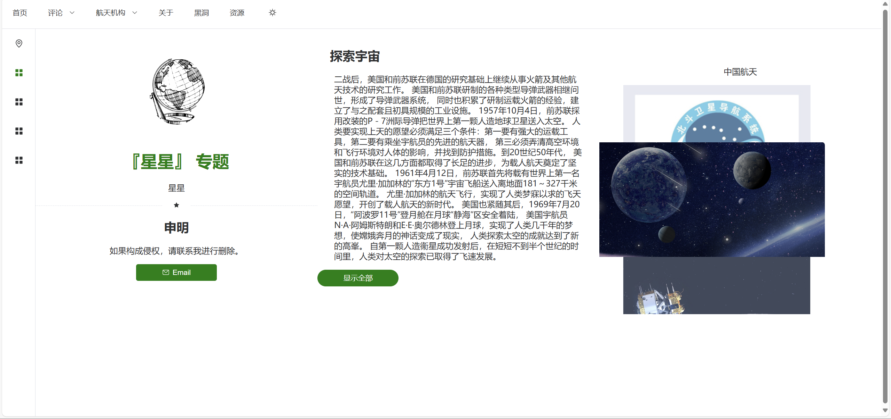
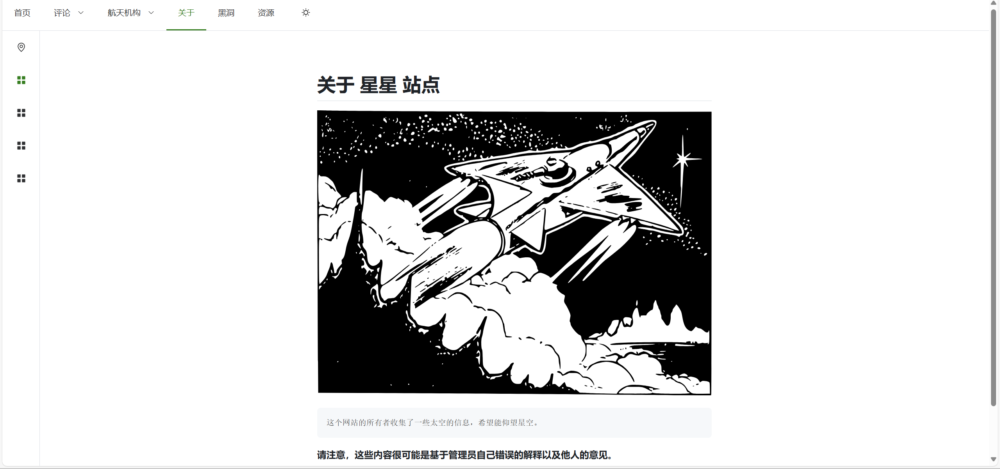

# Contest-HTML

星星 探索宇宙


[!IMPORTANT] 这个项目是临时的，不会长期维护

> 一个比赛项目使用 Element Plus 以及 Vite 构建

在线演示，部署于 [GitHub Pages](https://yuzhii0718.github.io/Test-Contest-HTML/)

> 特性

- 使用 Vite 构建
- 使用 Element Plus
- 使用 TypeScript
- 支持 Dark Mode
- Markdown 渲染
- 移动端适配

## setup

```bash
npm install
```

### dev

```bash
npm run dev
```

### build

```bash
npm run build
```

## 用法

```bash
git clone git@github.com:Yuzhii0718/Test-Contest-HTML.git
cd Test-Contest-HTML
npm i
npm run dev
```

## 在本地打开 dist

```bash
npx serve dist
```

或者使用 http-server

```bash
npm i -g http-server
http-server dist
```

或者其他可以打开静态文件的开发工具

比如 VSCode 插件 Live Server、WebStorm、HBuilder、Adobe Dreamweaver 等

## 部署静态页面到服务器

> 注意，需要在 `vite.config.ts` 文件中将 vue 别名注释

```bash
npm run generate
python publish_dist.py
```

然后将文件上传到服务器

## Preview




